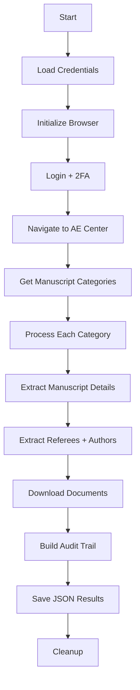

# 🏗️ Editorial Extractors Architecture

## Overview

The editorial extractors are production-grade Python applications that automate data extraction from academic journal manuscript management systems.

## Core Architecture

### Platform Foundation
- **Target Platform:** ScholarOne Manuscripts
- **Journals:** Mathematical Finance (MF) + Mathematics of Operations Research (MOR)
- **Technology Stack:** Selenium WebDriver, Python 3.8+, Gmail API

### Extractor Design Pattern

```
ComprehensiveExtractor
├── Authentication (Keychain + 2FA)
├── Browser Management (Selenium)
├── Data Extraction (XPath selectors)  
├── Email Processing (Popup windows)
├── Document Downloads (PDFs, Word)
├── Cache Management (Performance)
└── Output Generation (JSON)
```

## Key Components

### 1. Authentication System
- **Secure Storage:** macOS Keychain integration
- **2FA Handling:** Gmail API for verification codes  
- **Auto-login:** Persistent session management
- **Error Recovery:** Retry mechanisms with exponential backoff

### 2. Browser Management
- **Selenium WebDriver:** Chrome-based automation
- **Window Handling:** Popup management for email extraction
- **Frame Navigation:** Complex iframe handling
- **Error Handling:** Graceful failure recovery

### 3. Data Extraction Engine
- **Multi-pass System:** Forward → Backward → Forward extraction
- **XPath Selectors:** Robust element location
- **Popup Processing:** Email extraction from JavaScript windows  
- **Document Downloads:** Automated PDF/Word retrieval

### 4. Caching System
- **Performance:** Avoid re-extracting unchanged data
- **Storage:** Local filesystem cache
- **Invalidation:** Time-based and content-based
- **Testing:** Isolated test caches

## Extraction Flow



## File Organization

### Production Files
- `mf_extractor.py` - Mathematical Finance extractor (3,939 lines)
- `mor_extractor.py` - Mathematics of Operations Research extractor

### Configuration
- Credentials: macOS Keychain (automatic)
- Settings: Environment variables
- Downloads: `downloads/` directory

### Output
- JSON files: Timestamped comprehensive data
- PDFs: `downloads/referee_reports/`
- Logs: Console output with progress indicators

## Data Models

### Manuscript Object
```python
{
    "id": "MAFI-2025-0212",
    "title": "Paper Title",
    "status": "Under Review", 
    "authors": [...],     # Author objects with emails
    "referees": [...],    # Referee objects with reports
    "documents": {...},   # File tracking
    "audit_trail": [...], # Complete timeline
    "metadata": {...}     # Platform-specific fields
}
```

### Author/Referee Objects
```python
{
    "name": "Dr. Researcher",
    "email": "researcher@university.edu",  # Extracted from popups
    "affiliation": "University Name",
    "orcid": "https://orcid.org/...",      # Enriched data
    "status": "Agreed",
    "dates": {...},
    "report": {...}       # For referees only
}
```

## Performance Characteristics

- **Login Time:** 30-60 seconds (including 2FA)
- **Per Manuscript:** 10-30 seconds extraction time
- **Email Success Rate:** 
  - Authors: ~70% (MF working)
  - Referees: 0% (both broken - needs fixing)
- **Document Downloads:** Automatic with retry
- **Memory Usage:** ~200MB peak during extraction

## Error Handling

- **Network Issues:** Automatic retry with exponential backoff
- **Element Not Found:** Multiple selector strategies
- **Popup Failures:** Graceful degradation
- **Authentication:** Re-login on session expiry
- **Critical Failures:** Clean shutdown with error logs

## Security Features

- **Credential Storage:** Encrypted macOS Keychain only
- **No Code Secrets:** Never stored in source code
- **Session Management:** Automatic cleanup
- **Download Safety:** Validated file types and paths

## Extensibility

The architecture supports:
- Additional journals on ScholarOne platform
- New data extraction fields
- Alternative output formats
- Enhanced enrichment services (ORCID, MathSciNet)

---

**Architecture Status:** Production Stable  
**Last Review:** August 22, 2025